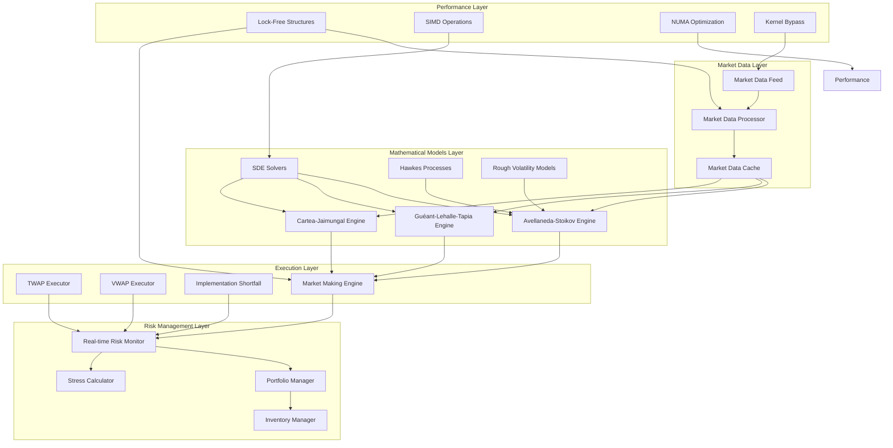

# Advanced Trading Features Design

## Overview

This design document outlines the architecture for implementing sophisticated market making algorithms, optimal execution strategies, and ultra-low latency performance optimizations. The system integrates cutting-edge mathematical finance models with high-performance computing techniques to achieve sub-microsecond latency while maintaining numerical accuracy and stability.

The design follows a modular architecture with clear separation between mathematical models, execution engines, risk management, and performance optimization layers. Each component is designed for maximum performance while maintaining code clarity and testability.

## Architecture

### High-Level System Architecture



### Core Components Architecture

The system is organized into several key architectural layers:

1. **Mathematical Foundation Layer**: Implements SDE solvers, stochastic processes, and numerical methods
2. **Model Implementation Layer**: Contains specific trading models (Avellaneda-Stoikov, etc.)
3. **Execution Engine Layer**: Handles order execution and market making logic
4. **Risk Management Layer**: Real-time risk monitoring and portfolio optimization
5. **Performance Optimization Layer**: Ultra-low latency optimizations and hardware acceleration

## Components and Interfaces

### 1. Mathematical Foundation Layer

#### SDE Solver Framework

```rust
pub trait SDESolver<State, Params> {
    fn solve_step(
        &mut self,
        t: FixedPoint,
        state: &State,
        dt: FixedPoint,
        params: &Params,
        rng: &mut DeterministicRng,
    ) -> Result<State, SDEError>;
    
    fn solve_path(
        &mut self,
        t_span: (FixedPoint, FixedPoint),
        initial: State,
        params: &Params,
        n_steps: usize,
        rng: &mut DeterministicRng,
    ) -> Result<Vec<State>, SDEError>;
}

pub struct EulerMaruyamaGBMJump {
    jump_generator: PoissonJumpGenerator,
    normal_generator: BoxMullerGenerator,
}

pub struct MilsteinGBMJump {
    jump_generator: PoissonJumpGenerator,
    normal_generator: BoxMullerGenerator,
    second_order_correction: bool,
}

pub struct RoughVolatilitySolver {
    fbm_generator: FractionalBrownianMotion,
    hurst_parameter: FixedPoint,
    max_history: usize,
}
```

#### Hawkes Process Engine

```rust
pub struct MultivariateHawkesSimulator {
    baseline_intensities: Vec<FixedPoint>,
    excitation_matrix: Vec<Vec<FixedPoint>>,
    decay_rates: Vec<Vec<FixedPoint>>,
    kernel_type: KernelType,
    event_history: VecDeque<HawkesEvent>,
}

pub struct HawkesIntensityCalculator {
    current_intensities: Vec<FixedPoint>,
    last_update_time: FixedPoint,
    intensity_cache: LRUCache<u64, Vec<FixedPoint>>,
}

impl MultivariateHawkesSimulator {
    pub fn calculate_intensity(&self, t: FixedPoint, dimension: usize) -> FixedPoint;
    pub fn simulate_next_event(&mut self, rng: &mut DeterministicRng) -> Option<HawkesEvent>;
    pub fn update_intensity(&mut self, current_time: FixedPoint);
}
```

### 2. Market Making Models

#### Avellaneda-Stoikov Implementation

```rust
pub struct AvellanedaStoikovEngine {
    // Model parameters
    risk_aversion: FixedPoint,
    volatility_estimator: RealizedVolatilityEstimator,
    inventory_tracker: InventoryTracker,
    market_impact_model: MarketImpactModel,
    
    // Optimization components
    hjb_solver: HJBSolver,
    reservation_price_calculator: ReservationPriceCalculator,
    spread_optimizer: SpreadOptimizer,
    
    // Performance optimization
    quote_cache: LockFreeCache<QuoteKey, OptimalQuotes>,
    parameter_cache: AtomicParameterCache,
}

pub struct OptimalQuotes {
    pub bid_price: Price,
    pub ask_price: Price,
    pub bid_size: Volume,
    pub ask_size: Volume,
    pub reservation_price: Price,
    pub optimal_spread: FixedPoint,
    pub timestamp: u64,
}

impl AvellanedaStoikovEngine {
    pub fn calculate_optimal_quotes(
        &mut self,
        mid_price: Price,
        inventory: i64,
        volatility: FixedPoint,
        time_to_maturity: FixedPoint,
        market_state: &MarketState,
    ) -> Result<OptimalQuotes, ModelError>;
    
    pub fn update_parameters(
        &mut self,
        new_risk_aversion: FixedPoint,
        new_impact_params: MarketImpactParams,
    );
    
    pub fn calculate_reservation_price(
        &self,
        mid_price: Price,
        inventory: i64,
        volatility: FixedPoint,
        time_horizon: FixedPoint,
    ) -> Price;
}
```

#### Guéant-Lehalle-Tapia Multi-Asset Engine

```rust
pub struct GuéantLehalleTapiaEngine {
    // Multi-asset parameters
    asset_correlations: CorrelationMatrix,
    cross_asset_risk_aversion: RiskAversionMatrix,
    portfolio_constraints: PortfolioConstraints,
    
    // Optimization components
    multi_dimensional_hjb: MultiDimensionalHJBSolver,
    portfolio_optimizer: PortfolioOptimizer,
    correlation_estimator: DynamicCorrelationEstimator,
    
    // Cross-asset analytics
    cointegration_detector: CointegrationDetector,
    arbitrage_scanner: ArbitrageScanner,
    hedge_ratio_optimizer: HedgeRatioOptimizer,
}

pub struct MultiAssetOptimalQuotes {
    pub quotes_by_asset: HashMap<AssetId, OptimalQuotes>,
    pub portfolio_risk: FixedPoint,
    pub cross_asset_adjustments: HashMap<(AssetId, AssetId), FixedPoint>,
    pub hedge_recommendations: Vec<HedgeRecommendation>,
}

impl GuéantLehalleTapiaEngine {
    pub fn calculate_multi_asset_quotes(
        &mut self,
        market_states: &HashMap<AssetId, MarketState>,
        portfolio_inventory: &HashMap<AssetId, i64>,
        correlation_matrix: &CorrelationMatrix,
    ) -> Result<MultiAssetOptimalQuotes, ModelError>;
    
    pub fn update_correlation_matrix(&mut self, new_correlations: CorrelationMatrix);
    pub fn detect_arbitrage_opportunities(&self) -> Vec<ArbitrageOpportunity>;
}
```

#### Cartea-Jaimungal Jump-Diffusion Engine

```rust
pub struct CarteaJaimungalEngine {
    // Jump-diffusion parameters
    jump_intensity_estimator: JumpIntensityEstimator,
    jump_size_estimator: JumpSizeEstimator,
    diffusion_estimator: DiffusionEstimator,
    
    // Jump detection
    jump_detector: BiPowerVariationJumpDetector,
    regime_detector: RegimeDetector,
    clustering_detector: JumpClusteringDetector,
    
    // Model components
    jump_diffusion_solver: JumpDiffusionSolver,
    hawkes_jump_intensity: HawkesJumpIntensity,
    double_exponential_jumps: DoubleExponentialJumpGenerator,
}

pub struct JumpAdjustedQuotes {
    pub base_quotes: OptimalQuotes,
    pub jump_risk_premium: FixedPoint,
    pub asymmetric_adjustment: FixedPoint,
    pub regime_adjustment: FixedPoint,
    pub clustering_adjustment: FixedPoint,
}

impl CarteaJaimungalEngine {
    pub fn calculate_jump_adjusted_quotes(
        &mut self,
        base_quotes: &OptimalQuotes,
        jump_intensity: FixedPoint,
        jump_parameters: &JumpParameters,
        inventory: i64,
        regime_state: RegimeState,
    ) -> Result<JumpAdjustedQuotes, ModelError>;
    
    pub fn detect_jumps(&mut self, price_series: &[Price]) -> Vec<JumpEvent>;
    pub fn estimate_jump_parameters(&mut self, jump_events: &[JumpEvent]) -> JumpParameters;
}
```

### 3. Execution Engines

#### TWAP Execution Engine

```rust
pub struct TWAPExecutor {
    // Execution parameters
    total_quantity: Volume,
    execution_horizon: Duration,
    participation_rate_target: FixedPoint,
    
    // Adaptive components
    volume_forecaster: VolumeForecaster,
    market_impact_estimator: MarketImpactEstimator,
    execution_scheduler: AdaptiveScheduler,
    
    // Performance tracking
    execution_tracker: ExecutionTracker,
    benchmark_calculator: BenchmarkCalculator,
    slippage_analyzer: SlippageAnalyzer,
}

pub struct TWAPExecutionPlan {
    pub time_buckets: Vec<TimeBucket>,
    pub volume_schedule: Vec<Volume>,
    pub participation_rates: Vec<FixedPoint>,
    pub contingency_plans: Vec<ContingencyPlan>,
}

impl TWAPExecutor {
    pub fn create_execution_plan(
        &mut self,
        order: &Order,
        market_conditions: &MarketConditions,
        historical_patterns: &VolumePatterns,
    ) -> Result<TWAPExecutionPlan, ExecutionError>;
    
    pub fn execute_next_slice(
        &mut self,
        current_time: Timestamp,
        market_state: &MarketState,
    ) -> Result<ExecutionDecision, ExecutionError>;
    
    pub fn adapt_to_market_conditions(
        &mut self,
        new_conditions: &MarketConditions,
    ) -> Result<(), ExecutionError>;
}
```

### 4. Risk Management System

#### Real-Time Risk Monitor

```rust
pub struct RealTimeRiskMonitor {
    // Risk calculators
    var_calculator: VaRCalculator,
    expected_shortfall_calculator: ExpectedShortfallCalculator,
    stress_tester: StressTester,
    
    // Limit enforcement
    position_limits: PositionLimits,
    concentration_limits: ConcentrationLimits,
    loss_limits: LossLimits,
    
    // Real-time monitoring
    risk_metrics_cache: LockFreeCache<RiskKey, RiskMetrics>,
    limit_breach_detector: LimitBreachDetector,
    alert_system: AlertSystem,
}

pub struct RiskMetrics {
    pub portfolio_var: FixedPoint,
    pub expected_shortfall: FixedPoint,
    pub maximum_drawdown: FixedPoint,
    pub leverage_ratio: FixedPoint,
    pub concentration_risk: FixedPoint,
    pub liquidity_risk: FixedPoint,
}

impl RealTimeRiskMonitor {
    pub fn calculate_portfolio_risk(
        &mut self,
        positions: &HashMap<AssetId, Position>,
        market_data: &MarketData,
    ) -> Result<RiskMetrics, RiskError>;
    
    pub fn check_limits(&self, risk_metrics: &RiskMetrics) -> Vec<LimitBreach>;
    pub fn execute_risk_controls(&mut self, breaches: &[LimitBreach]) -> Result<(), RiskError>;
}
```

### 5. Performance Optimization Layer

#### Lock-Free Data Structures

```rust
pub struct LockFreeOrderBook {
    // Price levels using lock-free skip list
    bid_levels: LockFreeSkipList<Price, PriceLevel>,
    ask_levels: LockFreeSkipList<Price, PriceLevel>,
    
    // Order storage with hazard pointers
    orders: LockFreeHashMap<OrderId, Order>,
    order_allocator: LockFreeObjectPool<Order>,
    
    // Memory reclamation
    hazard_pointers: HazardPointerManager,
    epoch_manager: EpochBasedReclamation,
}

pub struct LockFreePriceLevel {
    price: AtomicU64,
    total_volume: AtomicU64,
    order_count: AtomicU32,
    orders: LockFreeLinkedList<OrderNode>,
}

impl LockFreeOrderBook {
    pub fn add_order(&self, order: Order) -> Result<(), OrderBookError>;
    pub fn cancel_order(&self, order_id: OrderId) -> Result<Option<Order>, OrderBookError>;
    pub fn match_order(&self, incoming_order: &Order) -> Vec<Match>;
    pub fn get_best_bid_ask(&self) -> Option<(Price, Price)>;
}
```

#### SIMD-Optimized Mathematical Operations

```rust
pub struct SIMDMathOperations;

impl SIMDMathOperations {
    // AVX-512 optimized matrix operations
    pub fn matrix_multiply_f64_avx512(
        a: &[f64],
        b: &[f64],
        result: &mut [f64],
        rows_a: usize,
        cols_a: usize,
        cols_b: usize,
    );
    
    // Vectorized price comparisons
    pub fn compare_prices_avx512(
        prices: &[Price],
        threshold: Price,
        results: &mut [bool],
    );
    
    // Parallel correlation calculations
    pub fn calculate_correlations_avx512(
        returns_matrix: &[Vec<f64>],
        correlation_matrix: &mut [f64],
    );
    
    // Vectorized option pricing
    pub fn black_scholes_vectorized(
        spots: &[f64],
        strikes: &[f64],
        times: &[f64],
        vols: &[f64],
        rates: &[f64],
        results: &mut [f64],
    );
}
```

#### NUMA-Aware Memory Management

```rust
pub struct NUMAMemoryManager {
    topology: NUMATopology,
    node_allocators: Vec<NUMANodeAllocator>,
    thread_affinity_manager: ThreadAffinityManager,
}

pub struct NUMANodeAllocator {
    node_id: u32,
    memory_pools: HashMap<usize, MemoryPool>,
    huge_page_allocator: HugePageAllocator,
}

impl NUMAMemoryManager {
    pub fn allocate_on_node<T>(&self, node_id: u32, count: usize) -> Result<*mut T, NUMAError>;
    pub fn get_optimal_node_for_thread(&self, thread_id: ThreadId) -> u32;
    pub fn bind_thread_to_node(&self, thread_id: ThreadId, node_id: u32) -> Result<(), NUMAError>;
}
```

## Data Models

### Core Financial Data Structures

```rust
#[repr(C, align(64))] // Cache line aligned
pub struct MarketState {
    pub mid_price: Price,
    pub bid_price: Price,
    pub ask_price: Price,
    pub bid_volume: Volume,
    pub ask_volume: Volume,
    pub last_trade_price: Price,
    pub last_trade_volume: Volume,
    pub timestamp: u64,
    pub sequence_number: u64,
    pub volatility: FixedPoint,
    pub order_flow_imbalance: FixedPoint,
    pub microstructure_noise: FixedPoint,
}

#[repr(C, align(64))]
pub struct Position {
    pub asset_id: AssetId,
    pub quantity: i64,
    pub average_price: Price,
    pub unrealized_pnl: FixedPoint,
    pub realized_pnl: FixedPoint,
    pub last_update: u64,
    pub risk_metrics: PositionRiskMetrics,
}

#[repr(C, align(64))]
pub struct OptimalQuoteParameters {
    pub risk_aversion: FixedPoint,
    pub volatility: FixedPoint,
    pub inventory: i64,
    pub time_to_maturity: FixedPoint,
    pub market_impact_params: MarketImpactParams,
    pub jump_parameters: Option<JumpParameters>,
    pub correlation_adjustments: Option<CorrelationAdjustments>,
}
```

### Mathematical Model Parameters

```rust
pub struct AvellanedaStoikovParams {
    pub gamma: FixedPoint,           // Risk aversion
    pub sigma: FixedPoint,           // Volatility
    pub k: FixedPoint,               // Market impact parameter
    pub A: FixedPoint,               // Order arrival rate
    pub T: FixedPoint,               // Time horizon
}

pub struct JumpParameters {
    pub lambda: FixedPoint,          // Jump intensity
    pub eta_plus: FixedPoint,        // Upward jump decay
    pub eta_minus: FixedPoint,       // Downward jump decay
    pub p: FixedPoint,               // Upward jump probability
    pub regime_dependent: bool,
}

pub struct CorrelationMatrix {
    pub matrix: Vec<Vec<FixedPoint>>,
    pub eigenvalues: Vec<FixedPoint>,
    pub eigenvectors: Vec<Vec<FixedPoint>>,
    pub condition_number: FixedPoint,
    pub last_update: u64,
}
```

## Error Handling

### Comprehensive Error Types

```rust
#[derive(Debug, Error)]
pub enum AdvancedTradingError {
    #[error("Mathematical model error: {0}")]
    ModelError(#[from] ModelError),
    
    #[error("SDE solver error: {0}")]
    SDEError(#[from] SDEError),
    
    #[error("Execution error: {0}")]
    ExecutionError(#[from] ExecutionError),
    
    #[error("Risk management error: {0}")]
    RiskError(#[from] RiskError),
    
    #[error("Performance optimization error: {0}")]
    PerformanceError(#[from] PerformanceError),
    
    #[error("Numerical precision error: {0}")]
    NumericalError(String),
    
    #[error("Hardware acceleration error: {0}")]
    HardwareError(String),
}

#[derive(Debug, Error)]
pub enum ModelError {
    #[error("Parameter validation failed: {0}")]
    InvalidParameters(String),
    
    #[error("Numerical instability detected: {0}")]
    NumericalInstability(String),
    
    #[error("Convergence failure: {0}")]
    ConvergenceFailure(String),
    
    #[error("Matrix operation failed: {0}")]
    MatrixError(String),
}
```

### Error Recovery Strategies

```rust
pub struct ErrorRecoveryManager {
    fallback_models: HashMap<ModelType, Box<dyn FallbackModel>>,
    parameter_validators: Vec<Box<dyn ParameterValidator>>,
    numerical_stabilizers: Vec<Box<dyn NumericalStabilizer>>,
}

impl ErrorRecoveryManager {
    pub fn handle_model_error(
        &self,
        error: &ModelError,
        context: &ModelContext,
    ) -> Result<RecoveryAction, RecoveryError>;
    
    pub fn validate_parameters<T>(&self, params: &T) -> Result<(), ValidationError>
    where
        T: Validatable;
    
    pub fn stabilize_calculation(
        &self,
        calculation: &mut dyn NumericalCalculation,
    ) -> Result<(), StabilizationError>;
}
```

## Testing Strategy

### Unit Testing Framework

```rust
#[cfg(test)]
mod tests {
    use super::*;
    use proptest::prelude::*;
    use criterion::{black_box, criterion_group, criterion_main, Criterion};
    
    // Property-based testing for mathematical models
    proptest! {
        #[test]
        fn avellaneda_stoikov_properties(
            gamma in 0.01f64..10.0,
            sigma in 0.01f64..1.0,
            inventory in -1000i64..1000,
            time_to_maturity in 0.001f64..1.0,
        ) {
            let params = AvellanedaStoikovParams {
                gamma: FixedPoint::from_float(gamma),
                sigma: FixedPoint::from_float(sigma),
                k: FixedPoint::from_float(0.1),
                A: FixedPoint::from_float(1.0),
                T: FixedPoint::from_float(time_to_maturity),
            };
            
            let mut engine = AvellanedaStoikovEngine::new(params).unwrap();
            let quotes = engine.calculate_optimal_quotes(
                Price::from_float(100.0),
                inventory,
                FixedPoint::from_float(sigma),
                FixedPoint::from_float(time_to_maturity),
                &MarketState::default(),
            ).unwrap();
            
            // Test mathematical properties
            prop_assert!(quotes.ask_price > quotes.bid_price);
            prop_assert!(quotes.reservation_price >= quotes.bid_price);
            prop_assert!(quotes.reservation_price <= quotes.ask_price);
            
            // Test inventory skew
            if inventory > 0 {
                prop_assert!(quotes.reservation_price < Price::from_float(100.0));
            } else if inventory < 0 {
                prop_assert!(quotes.reservation_price > Price::from_float(100.0));
            }
        }
    }
    
    // Performance benchmarks
    fn benchmark_avellaneda_stoikov(c: &mut Criterion) {
        let params = AvellanedaStoikovParams::default();
        let mut engine = AvellanedaStoikovEngine::new(params).unwrap();
        
        c.bench_function("avellaneda_stoikov_quote_calculation", |b| {
            b.iter(|| {
                engine.calculate_optimal_quotes(
                    black_box(Price::from_float(100.0)),
                    black_box(50),
                    black_box(FixedPoint::from_float(0.2)),
                    black_box(FixedPoint::from_float(0.1)),
                    black_box(&MarketState::default()),
                )
            })
        });
    }
    
    criterion_group!(benches, benchmark_avellaneda_stoikov);
    criterion_main!(benches);
}
```

### Integration Testing

```rust
#[cfg(test)]
mod integration_tests {
    use super::*;
    use tokio::test;
    
    #[tokio::test]
    async fn test_end_to_end_market_making() {
        // Setup test environment
        let mut market_data_feed = MockMarketDataFeed::new();
        let mut risk_monitor = RealTimeRiskMonitor::new();
        let mut execution_engine = MarketMakingEngine::new();
        
        // Configure models
        let as_engine = AvellanedaStoikovEngine::new(
            AvellanedaStoikovParams::default()
        ).unwrap();
        
        execution_engine.add_model(Box::new(as_engine));
        
        // Simulate market data
        let market_updates = generate_realistic_market_data(1000);
        
        for update in market_updates {
            market_data_feed.send_update(update).await;
            
            // Process update through entire pipeline
            let quotes = execution_engine.process_market_update(&update).await?;
            let risk_check = risk_monitor.validate_quotes(&quotes).await?;
            
            assert!(risk_check.is_valid());
            assert!(quotes.bid_price < quotes.ask_price);
        }
    }
    
    #[tokio::test]
    async fn test_performance_under_load() {
        let mut system = AdvancedTradingSystem::new().await;
        
        // Generate high-frequency market data
        let updates_per_second = 100_000;
        let duration = Duration::from_secs(10);
        
        let start = Instant::now();
        let mut update_count = 0;
        
        while start.elapsed() < duration {
            let update = generate_market_update();
            system.process_update(update).await?;
            update_count += 1;
            
            if update_count % 10_000 == 0 {
                let latency = system.get_average_latency();
                assert!(latency < Duration::from_nanos(500));
            }
        }
        
        let final_throughput = update_count as f64 / duration.as_secs_f64();
        assert!(final_throughput >= updates_per_second as f64 * 0.95);
    }
}
```

This comprehensive design provides the foundation for implementing all the sophisticated mathematical models and performance optimizations specified in the requirements. The modular architecture ensures that each component can be developed, tested, and optimized independently while maintaining system-wide performance and reliability.