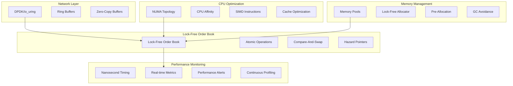

# Performance Optimization Design Document

## Overview

This design document outlines the architecture for achieving sub-microsecond latency in the zkVM-optimized CLOB system through lock-free data structures, memory pool management, NUMA optimization, and zero-copy networking.

## Architecture

### High-Level Performance Architecture



## Components and Interfaces

### 1. Lock-Free Order Book

#### Design Principles
- **Wait-Free Algorithms**: All operations complete in bounded time
- **Memory Ordering**: Careful use of memory barriers and atomic operations
- **ABA Problem Prevention**: Use of hazard pointers and epoch-based reclamation
- **Cache-Line Alignment**: Prevent false sharing between threads

#### Core Data Structures

```rust
// Lock-free price level using atomic linked list
pub struct LockFreePriceLevel {
    price: u64,
    total_volume: AtomicU64,
    order_count: AtomicU32,
    orders: AtomicPtr<LockFreeOrderNode>,
    next_level: AtomicPtr<LockFreePriceLevel>,
}

// Lock-free order node with hazard pointer protection
pub struct LockFreeOrderNode {
    order: Order,
    next: AtomicPtr<LockFreeOrderNode>,
    hazard_epoch: AtomicU64,
}

// Main lock-free order book
pub struct LockFreeOrderBook {
    bids: AtomicPtr<LockFreePriceLevel>,
    asks: AtomicPtr<LockFreePriceLevel>,
    sequence: AtomicU64,
    hazard_manager: HazardPointerManager,
}
```

#### Memory Reclamation Strategy
- **Epoch-Based Reclamation**: Safe memory reclamation without locks
- **Hazard Pointers**: Protect nodes from premature deallocation
- **Grace Periods**: Ensure all threads have observed updates before reclamation

### 2. Memory Pool Management

#### Pool Architecture
```rust
pub struct MemoryPoolManager {
    order_pool: LockFreePool<Order>,
    trade_pool: LockFreePool<Trade>,
    node_pool: LockFreePool<LockFreeOrderNode>,
    level_pool: LockFreePool<LockFreePriceLevel>,
    numa_allocator: NumaAllocator,
}

pub struct LockFreePool<T> {
    free_list: AtomicPtr<PoolNode<T>>,
    capacity: AtomicUsize,
    allocated: AtomicUsize,
    numa_node: u32,
}
```

#### Allocation Strategy
- **Pre-Allocation**: Allocate pools at startup based on expected peak load
- **NUMA-Aware**: Allocate memory on local NUMA nodes
- **Lock-Free**: Use atomic operations for pool management
- **Expansion**: Dynamic pool expansion without blocking operations

### 3. NUMA Optimization

#### NUMA Topology Management
```rust
pub struct NumaTopology {
    nodes: Vec<NumaNode>,
    cpu_to_node: HashMap<u32, u32>,
    memory_policy: MemoryPolicy,
}

pub struct NumaNode {
    node_id: u32,
    cpus: Vec<u32>,
    memory_size: usize,
    local_pools: HashMap<TypeId, Box<dyn Pool>>,
}
```

#### CPU Affinity Strategy
- **Thread Pinning**: Pin critical threads to specific CPU cores
- **Interrupt Affinity**: Route network interrupts to dedicated cores
- **Isolation**: Isolate trading threads from system processes
- **Load Balancing**: Distribute work across NUMA nodes efficiently

### 4. Zero-Copy Networking

#### Network Stack Architecture
```rust
pub struct ZeroCopyNetworkStack {
    dpdk_interface: DpdkInterface,
    ring_buffers: Vec<RingBuffer>,
    packet_pools: Vec<PacketPool>,
    flow_director: FlowDirector,
}

pub struct RingBuffer {
    producer_head: AtomicU32,
    producer_tail: AtomicU32,
    consumer_head: AtomicU32,
    consumer_tail: AtomicU32,
    ring: Vec<AtomicPtr<Packet>>,
}
```

#### Packet Processing Pipeline
1. **Hardware Receive**: DPDK polls network interface
2. **Flow Classification**: Direct packets to appropriate queues
3. **Zero-Copy Processing**: Process packets in-place without copying
4. **Batch Processing**: Process multiple packets together for efficiency

### 5. Performance Monitoring

#### Nanosecond-Precision Timing
```rust
pub struct NanosecondTimer {
    tsc_frequency: u64,
    calibration_offset: i64,
}

impl NanosecondTimer {
    #[inline(always)]
    pub fn now_nanos(&self) -> u64 {
        unsafe {
            let tsc = core::arch::x86_64::_rdtsc();
            ((tsc * 1_000_000_000) / self.tsc_frequency) as u64
        }
    }
}
```

#### Real-Time Metrics Collection
- **Lock-Free Counters**: Atomic counters for high-frequency metrics
- **Histogram Buckets**: Pre-allocated buckets for latency distribution
- **Circular Buffers**: Ring buffers for time-series data
- **Memory-Mapped Files**: Share metrics with monitoring processes

## Data Models

### Performance Metrics Schema
```rust
#[repr(C, align(64))] // Cache-line aligned
pub struct PerformanceMetrics {
    // Latency metrics (nanoseconds)
    order_processing_latency: LatencyHistogram,
    matching_latency: LatencyHistogram,
    network_latency: LatencyHistogram,
    
    // Throughput metrics
    orders_per_second: AtomicU64,
    trades_per_second: AtomicU64,
    messages_per_second: AtomicU64,
    
    // Resource utilization
    cpu_utilization: [AtomicU8; 64], // Per-core utilization
    memory_utilization: AtomicU64,
    network_utilization: AtomicU64,
    
    // Error counters
    allocation_failures: AtomicU64,
    network_drops: AtomicU64,
    timeout_errors: AtomicU64,
}
```

### Memory Layout Optimization
- **Cache-Line Alignment**: Align frequently accessed data to cache lines
- **False Sharing Prevention**: Separate hot data accessed by different threads
- **Prefetch Optimization**: Use prefetch instructions for predictable access patterns
- **Memory Barriers**: Minimal use of memory barriers for correctness

## Error Handling

### Performance-Critical Error Handling
```rust
pub enum FastError {
    AllocationFailure,
    NetworkTimeout,
    InvalidOrder,
    SystemOverload,
}

// Error handling without heap allocation
pub struct ErrorBuffer {
    errors: [FastError; 1024],
    head: AtomicUsize,
    tail: AtomicUsize,
}
```

### Error Recovery Strategies
- **Graceful Degradation**: Reduce functionality under extreme load
- **Circuit Breakers**: Stop processing when error rates exceed thresholds
- **Fast Failover**: Switch to backup systems within microseconds
- **Error Batching**: Batch error reporting to avoid performance impact

## Testing Strategy

### Performance Testing Framework
```rust
pub struct PerformanceTestSuite {
    latency_tester: LatencyTester,
    throughput_tester: ThroughputTester,
    stress_tester: StressTester,
    regression_tester: RegressionTester,
}
```

### Test Scenarios
1. **Latency Tests**: Measure order-to-trade latency under various conditions
2. **Throughput Tests**: Validate 1M+ orders per second capability
3. **Stress Tests**: Test behavior under extreme load and resource pressure
4. **Regression Tests**: Ensure performance doesn't degrade over time

### Benchmarking Strategy
- **Baseline Measurements**: Establish performance baselines for all operations
- **Continuous Benchmarking**: Run performance tests on every commit
- **Performance Budgets**: Set maximum acceptable latency for each operation
- **Regression Detection**: Alert on any performance degradation >5%

## Deployment Considerations

### Hardware Requirements
- **CPU**: Intel/AMD with TSC, RDTSC support, >3.0GHz base frequency
- **Memory**: DDR4-3200 or faster, ECC recommended
- **Network**: 25Gbps+ with SR-IOV support
- **Storage**: NVMe SSD for logging and state persistence

### Operating System Tuning
- **Kernel**: Real-time kernel (PREEMPT_RT) or low-latency kernel
- **CPU Governor**: Performance mode, disable frequency scaling
- **Memory**: Disable swap, enable huge pages
- **Network**: Disable interrupt coalescing, enable busy polling

### Container Optimization
- **CPU Isolation**: Use cgroups to isolate trading processes
- **Memory Pinning**: Pin container memory to specific NUMA nodes
- **Network Namespace**: Dedicated network namespace for trading traffic
- **Priority Scheduling**: Use real-time scheduling for critical processes